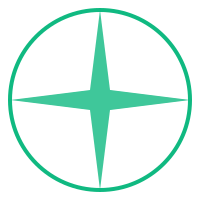

# POLARIS Project

<div align="center">
  
  <h3>Advancing Climate Science Through Innovation and Collaboration</h3>
  <p>A modern web platform for climate research and scientific collaboration</p>

  [](https://www.typescriptlang.org/)
  [](https://reactjs.org/)
  [](https://mui.com/)
  [](https://vitejs.dev/)
  [](LICENSE)
  
  <p>
    <a href="https://github.com/PolarisLabsDEV/Polaris">
      
    </a>
    <a href="https://x.com/PolarisLabs_AI">
      
    </a>
    <a href="https://polarislabs.me">
      
    </a>
  </p>
</div>

## 🌟 Overview

POLARIS is a cutting-edge research project focused on climate change and its impact on polar ecosystems. Our mission is to advance scientific understanding of climate dynamics and promote sustainable solutions for a changing world.

### Key Features

- 📊 **Interactive Data Visualization**: Real-time climate data visualization with dynamic charts and graphs
- 📚 **Research Database**: Comprehensive collection of publications and research findings
- 👥 **Team Collaboration**: Platform for researchers to collaborate and share findings
- 🌐 **Public Engagement**: Educational resources and interactive content for public awareness
- 📱 **Responsive Design**: Seamless experience across all devices and screen sizes

## 🚀 Getting Started

### Prerequisites

- Node.js (v16.0.0 or higher)
- npm (v8.0.0 or higher)
- Git

### Installation

1. Clone the repository
```bash
git clone https://github.com/PolarisLabsDEV/Polaris.git
cd polaris
```

2. Install dependencies
```bash
npm install
```

3. Create a `.env` file in the root directory
```bash
cp .env.example .env
```

4. Start the development server
```bash
npm run dev
```

5. Build for production
```bash
npm run build
```

## 🏗️ Project Structure

```
polaris/
├── public/                 # Static assets
│   └── images/            # Image assets
│       └── logo.svg       # Project logo (SVG format)
├── src/                   # Source code
│   ├── components/        # Reusable React components
│   │   ├── AnimatedSection/
│   │   ├── Newsletter/
│   │   ├── Publications/
│   │   └── ...
│   ├── layouts/          # Layout components
│   │   └── MainLayout.tsx
│   ├── pages/           # Page components
│   │   ├── Home/
│   │   ├── Research/
│   │   └── ...
│   ├── theme/           # MUI theme configuration
│   └── styles/          # Global styles
├── index.html           # Entry HTML file
└── package.json         # Project dependencies and scripts
```

## 🎨 Features & Components

### Core Components

- **MainLayout**: Main application layout with navigation and footer
- **AnimatedSection**: Reusable component for scroll-based animations
- **Publications**: Interactive publication database with search and filtering
- **ResearchHighlights**: Showcase of key research findings
- **Newsletter**: Email subscription component

### Pages

- **Home**: Landing page with project overview
- **Research**: Research areas and findings
- **Team**: Team member profiles
- **Publications**: Searchable publication database

## 🛠️ Technology Stack

- **Frontend Framework**: React 18 with TypeScript
- **UI Library**: Material-UI (MUI) v5
- **Build Tool**: Vite
- **Animation**: Framer Motion
- **State Management**: React Context
- **Routing**: React Router v6
- **Form Handling**: React Hook Form
- **Code Quality**: ESLint & Prettier

## 📖 Documentation

Detailed documentation for components and development guidelines can be found in the `/docs` directory:

- [Component Documentation](docs/components.md)
- [Development Guidelines](docs/development.md)
- [Contributing Guide](docs/contributing.md)
- [API Documentation](docs/api.md)

## 🤝 Contributing

We welcome contributions from the scientific and development communities! Please follow these steps:

1. Fork the repository
2. Create a feature branch (`git checkout -b feature/amazing-feature`)
3. Commit your changes (`git commit -m 'Add amazing feature'`)
4. Push to the branch (`git push origin feature/amazing-feature`)
5. Open a Pull Request

## 🙏 Acknowledgments

- Climate Research Community
- Open Source Contributors
- Environmental Science Partners
- Research Institutions Worldwide

---

<div align="center">
  Made with ❄️ by the POLARIS Team
</div> 